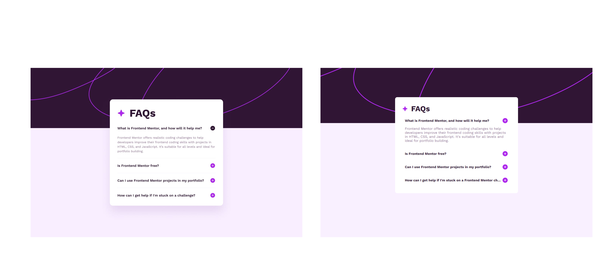

# Frontend Mentor - FAQ accordion

Essa é a solução para [Desafio FAQ accordion do Frontend Mentor](https://www.frontendmentor.io/challenges/faq-accordion-wyfFdeBwBz).

O objetivo do desafio era replicar o layout, desktop e mobile, de uma página com um acordeão de perguntas frequentes.

Abaixo estão as telas propostas pelo Frontend Mentor e o resultado obtido por mim:

Para o desenvolvimento das telas utilizei as ferramentas:

- HTML;
- CSS;
- JavaScript.

Aprendizados:

- Reforçar uso de tags HTML;
- Reforças estilização com CSS;
- Reforçar adaptação para responsividade;
- Desenvolvimento de interatividade por meio do JavaScript.
